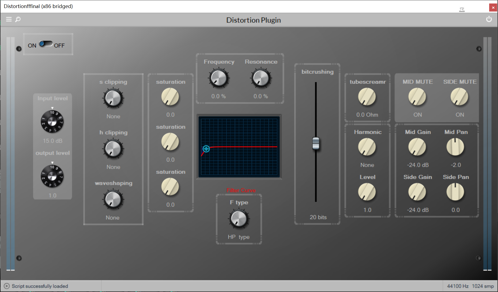

  # Audio Distortion Plugin

### Authors

Jiacheng Li 

## Date: 06/05/2024

## Introduction
In this program, I design a plugin that generates distortion.  The plugin can add distortion effects to the input sound and several other functions to adjust the pitch and increase it to the desired position, ultimately forming a new sound.  The basic functionality of this plugin is:  
First and foremost, audio distortion is a versatile tool with a myriad of applications in audio design.  It can be seamlessly integrated into various music genres as a special effect, lending a unique texture to the composition.  
In sound design, it serves as a powerful medium for artistic expression, and in the realm of electronic music and synthesizers, it opens up a world of creative possibilities.  
This versatility underscores the indispensability of audio distortion in audio design.  
Secondly, when audio plugins lack distortion effects, creating new audio plugins can help audio engineers better deal with various sound processing problems.  
When audio engineers use Reaper audio software to design, the audio editing software generally comes with many effects editing programs (to ensure simplicity and practicality).  
Therefore, audio designers must often import audio plugins from various external developers to complete necessary audio designs. 
Thus, the application of distortion effects software is essential.  

## Link for the survey
After you use or test this plug-in, I hope you can have some time to conduct the survey. This questionnaire will not collect any personal information but only collect knowledge questions and your opinions on using this plug-in to help me improve its functions and modify its problems. 
Here is the link to the survey: https://forms.office.com/e/c9eJiJX9DR  

## Reference

[1] Tube-screamer-analysis https://electrosmash.com/tube-screamer-analysis  
[2] Dutilleux, Pierre, and Udo Zölzer. "Nonlinear processing." DAFX: Digital Audio Effects (2002): 93-136.  
[3] Tarr, Eric. "The Development of Audio Software with Distortion." Distortion in Music Production. Focal Press, 2023. 13-27.  
[4] Inui, Masaki, Toshihiko Hamasaki, and Menno van der Veen. "Intermodulation distortion analysis of a guitar distortion pedal with a starving circuit." Journal of the Audio Engineering Society 69.1/2 (2021): 80-103.  
[5] Doug Bielmeier. Even better than the real thing: A comparison of traditional and software-emulated distortion in the contemporary audio production workflow. In Distortion in Music Production, pages 160–173. Focal Press, 2023.  

## License
Copyright © Jiacheng Li  
Powered by Blue Cat Audio  
www.bluecataudio.com  
